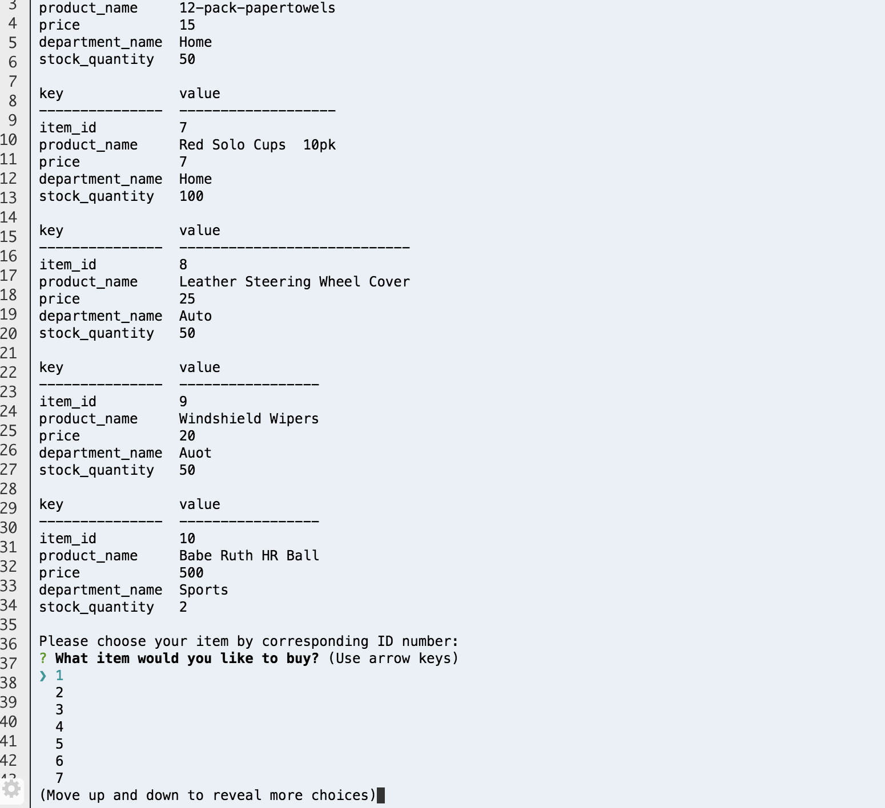

#Bamazon READ ME

##Customer is able to choose to **BUY** or login as and **ADMIN**

##When the user chooses to BUY, a table of all the available items along with Price, Department, and Quantity.

##After the user has had a chance to view his/her choices, they then select which item they would like to buy.  This is done by selecting the corresponding ID to the item the user wants.
###Use arrow keys to toggle through choices

##Now that the user has decided which item he/she would like to purchase, now we must know how many.
##In addition we now let the user know his/her total for the order.

##In the rare instance Bamazon is out of stock, the user is notified.

